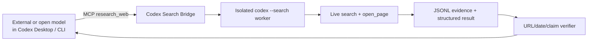

# Codex Search Bridge

Give any **tool-capable** model in Codex verified live-web research.

[简体中文](README.zh-CN.md) · [Architecture](docs/architecture.md) · [Security](docs/security.md)

> **Unofficial community project.** This repository is not affiliated with or endorsed by OpenAI. It uses the Codex installation, Codex authentication, web-search permission, and quota already available to the user.

Codex Search Bridge is a local Codex plugin with one deliberately simple research tool. An external or open-source model running inside Codex Desktop or Codex CLI calls `research_web`; the Bridge then starts an isolated Codex worker with native live search, captures real search/page events, validates cited URLs, and returns dated evidence to the same conversation.

It does **not** make a model without MCP/function calling magically tool-capable.

## What it proves

- A completed live `web_search` event actually occurred.
- Standard/deep research produced at least one `open_page` event.
- Cited source URLs appeared in the observed Codex event stream.
- `published_at`, `updated_at`, `event_date`, and `retrieved_at` remain separate.
- Unsupported claims become `unconfirmed`; incompatible sources remain `conflicting`.
- The result includes an explicit `as_of` time and limitations.

The Bridge rejects a response when a worker merely *says* it searched but provides no event evidence.

## Architecture



The child worker runs in a fresh temporary directory with `--ignore-user-config`, `--ignore-rules`, `--sandbox read-only`, `--ephemeral`, and plugins disabled to prevent recursion. See [docs/architecture.md](docs/architecture.md).

## Requirements

- Windows 10/11 or macOS; Linux is tested in CI as an additional platform.
- Node.js 20 or newer.
- Codex CLI available as `codex`, or `CODEX_SEARCH_BRIDGE_CODEX_BIN` set to its path.
- A valid Codex authentication session or OpenAI API configuration with available quota.
- Live Web Search allowed by the account and workspace policy.
- An external model that can reliably call MCP tools.

## Install

The commands are identical in macOS Terminal and Windows PowerShell:

```bash
codex plugin marketplace add Zhao73/codex-search-bridge
codex plugin add codex-search-bridge@codex-search-bridge
```

Start a new Codex task after installation so the model receives the new Skill and MCP tool.

Ask:

```text
Use verified web research to find today's most important AI release.
Open the relevant pages, distinguish publication date from event date,
cite sources, and list anything unconfirmed.
```

### Diagnose installation

Ask the current model to call the `doctor` tool. It checks Node, the Codex executable, authentication, structured output, `web_search_events`, and `opened_page_events`. The live check consumes a small amount of Codex quota.

Repository maintainers can run the same check directly:

```bash
npm ci
npm run build
npm run doctor
```

## Tool API

```json
{
  "question": "What changed in today's release?",
  "recency_hours": 24,
  "language": "en",
  "max_sources": 6,
  "depth": "standard"
}
```

| Field | Required | Meaning |
|---|---:|---|
| `question` | yes | Research question, 1–8,000 characters |
| `recency_hours` | no | Lookback from 1 to 8,760 hours |
| `date_from`, `date_to` | no | Inclusive `YYYY-MM-DD` bounds |
| `language` | no | BCP 47-style output/source preference |
| `max_sources` | no | 3–12, default 6 |
| `depth` | no | `quick`, `standard` (default), or `deep` |

`quick` requires a real search. `standard` and `deep` also require page-opening evidence. `deep` asks for independent corroboration of important claims.

## Evidence result

This abbreviated example comes from the deterministic integration fixture, not a claim about a current real-world event:

```json
{
  "answer": "The launch occurred on July 24.",
  "as_of": "2026-07-25T03:00:00Z",
  "claims": [
    {
      "claim": "The launch occurred on July 24.",
      "status": "confirmed",
      "confidence": "high",
      "event_date": "2026-07-24",
      "source_ids": ["S1"]
    }
  ],
  "verification": {
    "status": "verified",
    "web_search_events": 1,
    "opened_page_events": 1,
    "cited_sources_seen_in_events": 1,
    "total_cited_sources": 1
  },
  "limitations": []
}
```

## Compatibility status

Verified evidence is recorded with dates; a green unit test is not presented as physical platform proof.

| Surface | Current state as of 2026-07-25 |
|---|---|
| Codex CLI 0.145.0 on macOS | Local marketplace install and MCP integration tested |
| Codex Desktop on macOS | Uses the same plugin system; full UI flow pending recorded verification |
| Windows | Covered by GitHub Actions after publication; physical-machine verification not yet claimed |
| Linux | CI compatibility target, not a primary launch promise |
| External/open model | Requires MCP tool calling; individual models are verified separately |

See `docs/verification/` for sanitized run evidence as it becomes available.

## Privacy and security

Only the validated research request, time filters, language, and depth are forwarded to the isolated Codex worker. The Bridge does not intentionally forward the current project, conversation history, arbitrary environment variables, or external-model credentials.

The worker still sends the research request to the user's configured Codex service and consumes that user's quota. Web content is untrusted and can be malicious. Read [docs/security.md](docs/security.md) before deployment in a managed environment.

## Errors

| Code | Meaning |
|---|---|
| `INVALID_INPUT` | Invalid question, date, recency, or source limit |
| `CODEX_NOT_FOUND` | Codex CLI was not found |
| `CODEX_AUTH_REQUIRED` | Codex authentication is absent or expired |
| `WEB_SEARCH_UNAVAILABLE` | Account/workspace policy blocked live search |
| `WORKER_TIMEOUT` | Research exceeded its depth-specific timeout |
| `OUTPUT_LIMIT_EXCEEDED` | Worker output exceeded a safety cap |
| `INVALID_STRUCTURED_OUTPUT` | Worker JSON failed the result schema |
| `EVIDENCE_VERIFICATION_FAILED` | Search, opened-page, or source-URL proof was missing |
| `QUEUE_FULL` | Local bounded worker queue is full |

## Uninstall

```bash
codex plugin remove codex-search-bridge@codex-search-bridge
codex plugin marketplace remove codex-search-bridge
```

## Develop

```bash
npm ci
npm test
npm run typecheck
npm run build
npm run check
```

The test suite includes a fake Codex executable, MCP stdio integration, event fixtures, URL provenance checks, cancellation, limits, and package validation. Real Codex searches are deliberately excluded from ordinary PR CI because they require authentication and consume quota.

Read [CONTRIBUTING.md](CONTRIBUTING.md) before changing event parsing. Report security issues through the process in [SECURITY.md](SECURITY.md).

## License

Apache-2.0. “Codex” and “OpenAI” are trademarks of their respective owner; their names here describe interoperability only.
