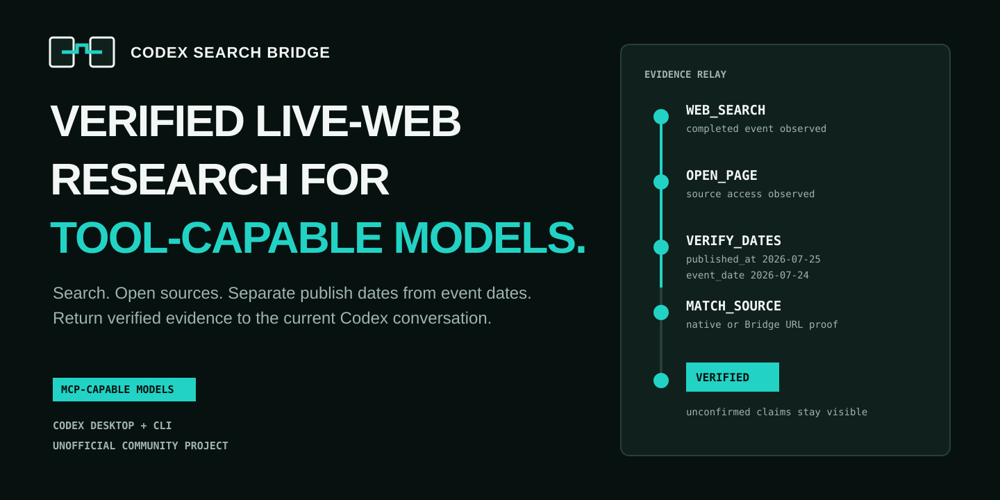
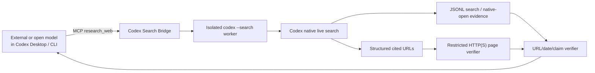

# Codex Search Bridge

[](https://github.com/Zhao73/codex-search-bridge/actions/workflows/ci.yml)
[](https://github.com/Zhao73/codex-search-bridge/releases)
[](LICENSE)



Bring verified live-web research to **tool-capable** models in Codex and Claude Code.

[简体中文](README.zh-CN.md) · [Architecture](docs/architecture.md) · [Security](docs/security.md)

> **Unofficial community project.** This repository is not affiliated with or endorsed by OpenAI or Anthropic. It uses the Codex installation, Codex authentication, web-search permission, and quota already available to the user.

Codex Search Bridge is a local plugin with one deliberately simple research tool. An external or open-source model running inside Codex Desktop, Codex CLI, or Claude Code calls `research_web`; the Bridge starts an isolated Codex worker with native live search, validates cited URLs, and returns dated evidence to the same conversation. If the installed Codex version does not expose a URL-bearing native page-open event, the Bridge opens cited pages through its own restricted HTTP(S) verifier. It never substitutes another search engine.

> **The host is not the search backend.** The host decides which model *calls* the tool; a **provider** decides what actually runs the search. Codex is the default, Claude Code is an equal-strength alternative, and a keyed search API covers users with neither subscription — see [Search providers](#search-providers).

It does **not** make a model without MCP/function calling magically tool-capable.

## What it proves

- A completed live `web_search` event actually occurred.
- Standard/deep research produced at least one attributable page open.
- `codex_open_page_events` and `bridge_fetch_events` show exactly which component opened pages; their sum is `opened_page_events`.
- `content_audit_passes` proves directly fetched page text was reconciled by a second isolated, live-searching Codex worker.
- Cited source URLs matched either URL-bearing Codex evidence or a successful restricted Bridge fetch.
- `published_at`, `updated_at`, `event_date`, and `retrieved_at` remain separate.
- Unsupported claims become `unconfirmed`; incompatible sources remain `conflicting`.
- The result includes an explicit `as_of` time and limitations.

The Bridge rejects a response when a worker merely *says* it searched but provides no event evidence.

## Architecture



The child worker runs with fresh `HOME`, `USERPROFILE`, `CODEX_HOME`, and temp roots. Only the existing `auth.json` is copied when API-key authentication is not in use; user Skills, plugins, MCP servers, configuration, and project files are not copied. Codex also receives `--ignore-user-config`, `--ignore-rules`, `--sandbox read-only`, `--ephemeral`, and plugins disabled to prevent recursion. See [docs/architecture.md](docs/architecture.md).

## Requirements

- Windows 10/11 or macOS; Linux is tested in CI as an additional platform.
- Node.js 20 or newer.
- Codex CLI available as `codex`, or `CODEX_SEARCH_BRIDGE_CODEX_BIN` set to its path.
- A valid Codex authentication session or OpenAI API configuration with available quota.
- Live Web Search allowed by the account and workspace policy.
- An external model that can reliably call either MCP tools or Codex's standard command tools.
- A host that speaks MCP: Codex CLI, the Codex app, or Claude Code.
- At least one working [search provider](#search-providers).

## Search providers

The host you install into and the backend that performs the search are separate choices. The Bridge picks the strongest available backend automatically.

| Provider | Needs | Max evidence tier | Runs |
| --- | --- | --- | --- |
| `codex` (default) | Codex CLI + Codex login + quota | `native_audited` | Isolated `codex --search` worker, fresh HOME/CODEX_HOME, read-only sandbox |
| `claude` | Claude Code CLI 2.1.220+ · Claude login | `native_audited` | Isolated `claude --print` worker with `WebSearch`/`WebFetch` only |
| `tavily` | `TAVILY_API_KEY` (free tier, no card) | `search_api` | Tavily query, then the Bridge's own restricted page verifier |

Auto-selection order is `codex` → `claude` → `tavily`: whichever is present first wins. Pin one explicitly with `CODEX_SEARCH_BRIDGE_PROVIDER`:

```bash
CODEX_SEARCH_BRIDGE_PROVIDER=claude   # force the Claude worker
CODEX_SEARCH_BRIDGE_PROVIDER=tavily   # force the keyed search API
CODEX_SEARCH_BRIDGE_PROVIDER=auto     # default
```

Every result reports which backend ran it:

```json
"verification": { "provider": "claude", "evidence_tier": "native_audited", "status": "verified" }
```

### What each tier actually proves

- **`native_audited`** — the provider's own live search ran, pages were opened, and a second isolated worker reconciled directly fetched page text against the answer. This is the only tier that can reach `"status": "verified"`.
- **`native`** — live search and page opens happened, but no content-audit pass ran.
- **`search_api`** — a third-party index supplied the URLs and only the Bridge's restricted HTTP(S) verifier opened them. **No model read the pages**, so claims are not attributed and dates are not reconciled. This tier is capped at `"status": "partial"` and returns a single `unconfirmed` claim no matter how clean the URL provenance looks. Treat it as a lead, not as confirmed research.

### Provider caveats

**Claude worker isolation is weaker than the Codex worker's.** Claude Code resolves its login from the user's config directory and the macOS Keychain; both a fresh `HOME` and an isolated `CLAUDE_CONFIG_DIR` make it report "Not logged in". The worker therefore keeps the real `HOME` and is confined on the command line instead: no MCP servers (`--strict-mcp-config`), no settings or hooks (`--setting-sources ""`), an allowlist limited to `WebSearch` and `WebFetch`, and a throwaway working directory. It cannot run shell commands or edit files, but it is not sandboxed to the same degree as the Codex worker.

**The Claude worker needs a recent CLI.** Isolation depends on `--setting-sources`, verified against Claude Code 2.1.220. An older CLI that does not recognise the flag makes the worker exit before searching; pin another provider with `CODEX_SEARCH_BRIDGE_PROVIDER` or upgrade Claude Code.

**A gateway-pointed environment is bypassed on purpose.** If `ANTHROPIC_BASE_URL` is set, the Claude worker drops it along with the gateway credentials and talks to the real Anthropic endpoint. An open-weight model behind a gateway has no server-side `WebSearch` tool, so inheriting the redirect would guarantee failure.

## Install

Pick the host you drive the model from. All three install paths share the same server, Skill, and evidence pipeline.

### Codex CLI and Codex app

The commands are identical in macOS Terminal and Windows PowerShell:

```bash
codex plugin marketplace add Zhao73/codex-search-bridge
codex plugin add codex-search-bridge@codex-search-bridge
```

Start a new Codex task after installation so the model receives the new Skill and MCP tool.

### Claude Code

Run these as slash commands inside Claude Code:

```text
/plugin marketplace add Zhao73/codex-search-bridge
/plugin install codex-search-bridge@codex-search-bridge
/reload-plugins
```

This registers the `research_web` and `doctor` MCP tools plus the bundled `verified-web-research` Skill. Confirm the server is up with `claude mcp list`; the entry appears as `plugin:codex-search-bridge:codex-search-bridge`.

Use this when Claude Code is pointed at a third-party or open-weight model through a custom `ANTHROPIC_BASE_URL` gateway: Claude Code's built-in web search is a server-side Anthropic tool and is unavailable on those endpoints, while this Bridge is an ordinary local MCP server and keeps working.

### Any other MCP client (npm)

The server is published to npm, so any MCP-capable client can launch it without installing a plugin:

```bash
claude mcp add codex-search-bridge -- npx -y codex-search-bridge
```

Or register it by hand in an `.mcp.json`:

```json
{
  "mcpServers": {
    "codex-search-bridge": {
      "type": "stdio",
      "command": "npx",
      "args": ["-y", "codex-search-bridge"]
    }
  }
}
```

The npm package ships only the bundled server; the `verified-web-research` Skill is plugin-only, so on this path prompt the model to call `research_web` explicitly.

Ask:

```text
Use verified web research to find today's most important AI release.
Open the relevant pages, distinguish publication date from event date,
cite sources, and list anything unconfirmed.
```

### Diagnose installation

Ask the current model to call the `doctor` tool. It checks Node, the Codex executable, authentication, structured output, `web_search_events`, and `opened_page_events`. The live check consumes a small amount of Codex quota.

Repository maintainers can run the same check directly:

```bash
npm ci
npm run build
npm run doctor
```

### Local-provider compatibility mode

Codex CLI 0.145.0 was observed to serialize installed MCP servers as `namespace` tools. Some OpenAI-compatible local providers, including the tested Ollama path, accept ordinary function tools but reject that tool type before the model gets a turn. Compatibility mode hides the MCP namespace and lets the bundled Skill call the exact same research engine through Codex's standard `exec_command` / `write_stdin` tools.

macOS or Linux:

```bash
CODEX_SEARCH_BRIDGE_CLI_ONLY=1 codex --oss --local-provider ollama -m <model>
```

If the outer Codex task uses `workspace-write`, its command sandbox must also be allowed to reach the Codex service used by the nested research worker:

```bash
CODEX_SEARCH_BRIDGE_CLI_ONLY=1 codex \
  -s workspace-write \
  -c 'sandbox_workspace_write.network_access=true' \
  --oss --local-provider ollama -m <model>
```

Windows PowerShell:

```powershell
$env:CODEX_SEARCH_BRIDGE_CLI_ONLY = "1"
codex --oss --local-provider ollama -m <model>
```

For PowerShell with a network-enabled workspace sandbox:

```powershell
codex -s workspace-write -c 'sandbox_workspace_write.network_access=true' `
  --oss --local-provider ollama -m <model>
```

The Skill resolves its packaged `scripts/research.mjs`, starts it with an interactive stdin but without embedding data in the command, waits for `CODEX_SEARCH_BRIDGE_READY`, and sends one bounded JSON request over stdin. It then polls the same session after `CODEX_SEARCH_BRIDGE_RESEARCHING_POLL_SESSION`; neither marker nor PTY input echo is a result. No question is placed on a command line. The same input validation, isolated Codex workers, live-search evidence, restricted page opens, content audit, and result verifier run in both modes.

Enabling sandbox network access applies to every command the outer model runs in that task, so use a trusted model and a narrow working directory. This is a protocol fallback, not a way to manufacture tool-use ability. The outer model must still follow the Skill and reliably use Codex's standard command tools. If it answers that it cannot browse without attempting the runner, treat that model/version as incompatible and do not present its answer as current research.

## Tool API

```json
{
  "question": "What changed in today's release?",
  "recency_hours": 24,
  "language": "en",
  "max_sources": 6,
  "depth": "standard"
}
```

| Field | Required | Meaning |
|---|---:|---|
| `question` | yes | Research question, 1-8,000 characters |
| `recency_hours` | no | Lookback from 1 to 8,760 hours |
| `date_from`, `date_to` | no | Inclusive `YYYY-MM-DD` bounds |
| `language` | no | BCP 47-style output/source preference |
| `max_sources` | no | 3-12, default 6 |
| `depth` | no | `quick`, `standard` (default), or `deep` |

`quick` requires a real search. `standard` and `deep` also require page-opening evidence. `deep` asks for independent corroboration of important claims.

## Evidence result

This abbreviated example comes from the deterministic integration fixture, not a claim about a current real-world event:

```json
{
  "answer": "The launch occurred on July 24.",
  "as_of": "2026-07-25T03:00:00Z",
  "claims": [
    {
      "claim": "The launch occurred on July 24.",
      "status": "confirmed",
      "confidence": "high",
      "event_date": "2026-07-24",
      "source_ids": ["S1"]
    }
  ],
  "verification": {
    "status": "verified",
    "web_search_events": 1,
    "opened_page_events": 1,
    "codex_open_page_events": 1,
    "bridge_fetch_events": 0,
    "content_audit_passes": 0,
    "cited_sources_verified": 1,
    "total_cited_sources": 1
  },
  "limitations": []
}
```

## Compatibility status

Verified evidence is recorded with dates; a green unit test is not presented as physical platform proof.

| Surface | Current state as of 2026-07-25 |
|---|---|
| Codex CLI 0.145.0 on macOS | Local marketplace install, MCP integration, authenticated research, and content audit tested |
| Codex Desktop on macOS | Uses the same plugin system; full UI flow pending recorded verification |
| Windows | GitHub Actions passed on Node 20/22; physical-machine verification not claimed |
| Linux | GitHub Actions passed on Node 20/22; not a primary launch promise |
| External/open model | Requires reliable MCP or standard command-tool use; individual models are verified separately |
| Ollama `qwen3:4b-instruct` + Codex CLI 0.145.0 | Negative test: the model did not invoke the runner even under an explicit command-tool prompt; autonomous Bridge use is not claimed |
| Ollama `qwen3.5:4b` + Codex CLI 0.145.0 | Negative test: command tools worked, but the model did not reliably complete the runner protocol and once fabricated a result from a readiness marker |

No external-model end-to-end success is claimed for v0.1.0. The MCP tool, CLI runner, isolated bundle, and authenticated Codex research path are verified independently; model-specific autonomous orchestration remains compatibility work.

See [docs/verification/](docs/verification/) for sanitized live evidence and the public CI record.

## Privacy and security

Only the validated research request, time filters, language, and depth are forwarded to the isolated Codex worker. The Bridge does not intentionally forward the current project, conversation history, arbitrary environment variables, user Skills, plugins, MCP configuration, or external-model credentials.

The restricted page verifier accepts only credential-free HTTP(S), resolves and pins public IP addresses, rejects local/private/reserved ranges, revalidates every redirect, sends no cookies or authorization headers, limits redirects/time/body bytes, and reports failures as limitations. Its compact visible-text excerpts go to a second isolated Codex audit pass, which must search live again and correct or downgrade stale draft claims. The fetcher is not an independent search backend.

The worker still sends the research request to the user's configured Codex service and consumes that user's quota. Web content is untrusted and can be malicious. Read [docs/security.md](docs/security.md) before deployment in a managed environment.

## Errors

| Code | Meaning |
|---|---|
| `INVALID_INPUT` | Invalid question, date, recency, or source limit |
| `CODEX_NOT_FOUND` | Codex CLI was not found |
| `CODEX_AUTH_REQUIRED` | Codex authentication is absent or expired |
| `WEB_SEARCH_UNAVAILABLE` | Account/workspace policy blocked live search |
| `WORKER_TIMEOUT` | Research exceeded its depth-specific timeout |
| `OUTPUT_LIMIT_EXCEEDED` | Worker output exceeded a safety cap |
| `INVALID_STRUCTURED_OUTPUT` | Worker JSON failed the result schema |
| `EVIDENCE_VERIFICATION_FAILED` | Search, opened-page, or source-URL proof was missing |
| `QUEUE_FULL` | Local bounded worker queue is full |

## Uninstall

Codex CLI and Codex app:

```bash
codex plugin remove codex-search-bridge@codex-search-bridge
codex plugin marketplace remove codex-search-bridge
```

Claude Code:

```text
/plugin uninstall codex-search-bridge@codex-search-bridge
/plugin marketplace remove codex-search-bridge
```

Installed via npm instead of a plugin:

```bash
claude mcp remove codex-search-bridge
```

## Develop

```bash
npm ci
npm test
npm run typecheck
npm run build
npm run check
```

The test suite includes a fake Codex executable, MCP stdio integration, event fixtures, URL provenance checks, cancellation, limits, and package validation. Real Codex searches are deliberately excluded from ordinary PR CI because they require authentication and consume quota.

Read [CONTRIBUTING.md](CONTRIBUTING.md) before changing event parsing. Report security issues through the process in [SECURITY.md](SECURITY.md).

## License

Apache-2.0. “Codex” and “OpenAI” are trademarks of their respective owner; their names here describe interoperability only.
