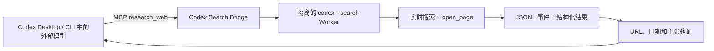

# Codex Search Bridge

让 Codex 中任何**能够调用工具**的外部／开源模型获得可验证的实时网页研究能力。

[English](README.md) · [架构](docs/architecture.md) · [安全](docs/security.md)

> **非官方 community 社区项目。** 本项目不隶属于 OpenAI，也未获得 OpenAI 官方背书。它使用用户现有的 Codex 安装、Codex authentication、联网权限和 quota 配额。

外部模型运行在 Codex Desktop 或 Codex CLI 里，只需调用一个 `research_web` MCP 工具。Bridge 会启动隔离的 Codex 原生实时搜索任务，检查真实搜索和网页打开事件，再把带来源、日期、冲突与未确认标记的结果返回当前对话。

它不能让完全不支持 MCP／函数调用的模型凭空获得工具能力。

## 它实际证明什么

- 捕获到了已完成的实时 `web_search_events`。
- 标准／深度研究捕获到了 `opened_page_events`，对应 `open_page` 网页动作。
- 引用的 URL 出现在 Codex 真实事件流中。
- `published_at`（发布时间）、`updated_at`（更新时间）、`event_date`（事件日期）、`retrieved_at`（访问时间）互不混淆。
- 无法支持的主张降级为 `unconfirmed`；来源冲突保留为 `conflicting`。
- 输出包含 `as_of` 截止时间与限制说明。

如果 Worker 只在文字里声称“已经搜索”，却没有事件证据，Bridge 会拒绝该结果。

## 工作方式



子任务使用全新临时目录，并启用 `--ignore-user-config`、`--ignore-rules`、`--sandbox read-only`、`--ephemeral`，同时禁用插件防止递归。细节见 [docs/architecture.md](docs/architecture.md)。

## 使用条件

- Windows 10/11 或 macOS；Linux 作为额外 CI 平台。
- Node.js 20 或以上。
- `codex` CLI 可直接执行，或设置 `CODEX_SEARCH_BRIDGE_CODEX_BIN`。
- 已完成 Codex authentication，并有可用 quota。
- 账户和工作区允许实时 Web Search。
- 当前外部模型能够可靠调用 MCP 工具。

## 安装

macOS Terminal 与 Windows PowerShell 使用相同命令：

```bash
codex plugin marketplace add Zhao73/codex-search-bridge
codex plugin add codex-search-bridge@codex-search-bridge
```

安装后新建一个 Codex 任务，让模型加载新的 Skill 和 MCP 工具。

示例请求：

```text
用 verified web research 查找今天最重要的 AI 发布。
打开相关网页，区分发布时间与事件日期，标明来源，并列出未确认信息。
```

### 诊断

让当前模型调用 `doctor`。它会检查 Node、Codex CLI、认证、结构化输出、`web_search_events` 和 `opened_page_events`。真实检查会消耗少量 Codex quota。

维护者也可以运行：

```bash
npm ci
npm run build
npm run doctor
```

## 工具参数

```json
{
  "question": "今天的版本发布改变了什么？",
  "recency_hours": 24,
  "language": "zh-CN",
  "max_sources": 6,
  "depth": "standard"
}
```

| 字段 | 必填 | 说明 |
|---|---:|---|
| `question` | 是 | 1–8,000 字符的研究问题 |
| `recency_hours` | 否 | 1–8,760 小时的回溯范围 |
| `date_from`, `date_to` | 否 | `YYYY-MM-DD` 日期边界 |
| `language` | 否 | BCP 47 风格语言标签 |
| `max_sources` | 否 | 3–12，默认 6 |
| `depth` | 否 | `quick`、默认 `standard` 或 `deep` |

`quick` 至少需要真实搜索；`standard` 和 `deep` 还必须拿出网页打开证据；`deep` 会要求关键主张尽量有独立来源交叉核验。

## 结果证据

以下只是确定性测试 fixture 的缩略示例，不代表真实世界的最新事件：

```json
{
  "as_of": "2026-07-25T03:00:00Z",
  "verification": {
    "status": "verified",
    "web_search_events": 1,
    "opened_page_events": 1,
    "cited_sources_seen_in_events": 1,
    "total_cited_sources": 1
  },
  "limitations": []
}
```

新闻输出必须分别说明 `published_at`、`updated_at`、`event_date` 与 `retrieved_at`，并在当前对话单列“未确认或冲突”。

## 当前兼容状态

| 使用面 | 截至 2026-07-25 的状态 |
|---|---|
| macOS + Codex CLI 0.145.0 | 已验证本地 Marketplace 安装及 MCP 集成 |
| macOS Codex Desktop | 共用插件系统；完整 UI 流程仍需保存验证记录 |
| Windows | GitHub 发布后由 Actions 覆盖；尚不声称完成 Windows 实机验证 |
| Linux | CI 兼容目标，不是首发主承诺 |
| 外部／开源模型 | 必须支持 MCP；各模型分别验证 |

验证记录保存在 `docs/verification/`。

## 隐私与安全

Bridge 只向隔离 Worker 传递经过验证的问题、时间范围、语言和深度。它不会主动转发当前项目文件、完整对话历史、任意环境变量或外部模型凭据。

研究问题仍会发送给用户配置的 Codex 服务并消耗自己的 quota；网页内容属于不可信输入。部署到团队环境前请阅读 [docs/security.md](docs/security.md)。

## 常见错误

- `CODEX_NOT_FOUND`：没有找到 Codex CLI。
- `CODEX_AUTH_REQUIRED`：Codex authentication 不存在或已失效。
- `WEB_SEARCH_UNAVAILABLE`：账户或工作区禁止实时搜索。
- `EVIDENCE_VERIFICATION_FAILED`：缺少搜索、打开网页或来源 URL 证据。
- `WORKER_TIMEOUT`：搜索超过深度对应的时限。
- `QUEUE_FULL`：本地有界队列已满。

## 卸载

```bash
codex plugin remove codex-search-bridge@codex-search-bridge
codex plugin marketplace remove codex-search-bridge
```

## 开发

```bash
npm ci
npm test
npm run typecheck
npm run build
npm run check
```

修改事件 Parser 前请阅读 [CONTRIBUTING.md](CONTRIBUTING.md)，安全问题按 [SECURITY.md](SECURITY.md) 私下报告。

## 许可证

Apache-2.0。“Codex”和“OpenAI”仅用于说明兼容关系，相关商标归其权利人所有。
