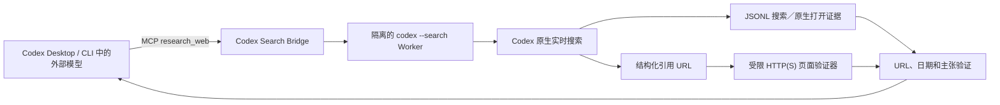

# Codex Search Bridge

[](https://github.com/Zhao73/codex-search-bridge/actions/workflows/ci.yml)
[](https://github.com/Zhao73/codex-search-bridge/releases)
[](LICENSE)


为 Codex 和 Claude Code 中**能够调用工具**的外部／开源模型提供可验证的实时网页研究通道。

[English](README.md) · [架构](docs/architecture.md) · [安全](docs/security.md)

> **非官方 community 社区项目。** 本项目不隶属于 OpenAI 或 Anthropic，也未获得官方背书。它使用用户现有的 Codex 安装、Codex authentication、联网权限和 quota 配额。

外部模型运行在 Codex Desktop、Codex CLI 或 Claude Code 里，只需调用一个 `research_web` MCP 工具。Bridge 会启动隔离的 Codex 原生实时搜索任务，核验真实搜索和引用 URL，再把带来源、日期、冲突与未确认标记的结果返回当前对话。如果当前 Codex 版本没有暴露带 URL 的原生网页打开事件，Bridge 会用受限 HTTP(S) 验证器直接打开引用页面，但绝不替换成另一套搜索引擎。

> **宿主不等于搜索后端。** 宿主只决定"由哪个模型*调用*这个工具"，真正执行搜索的是 **provider**。Codex 是默认后端，Claude Code 是同等强度的替代，另有一个带 key 的搜索 API 后端覆盖两种订阅都没有的用户，详见[搜索后端](#搜索后端)。

它不能让完全不支持 MCP／函数调用的模型凭空获得工具能力。

## 它实际证明什么

- 捕获到了已完成的实时 `web_search_events`。
- 标准／深度研究至少有一次可归因的网页打开。
- `codex_open_page_events` 与 `bridge_fetch_events` 分别说明是谁打开页面，两者之和为 `opened_page_events`。
- `content_audit_passes` 证明受限直连取得的页面正文已经由第二个隔离、再次实时搜索的 Codex Worker 复核。
- 引用 URL 必须匹配带 URL 的 Codex 证据，或由 Bridge 受限直连成功打开。
- `published_at`（发布时间）、`updated_at`（更新时间）、`event_date`（事件日期）、`retrieved_at`（访问时间）互不混淆。
- 无法支持的主张降级为 `unconfirmed`；来源冲突保留为 `conflicting`。
- 输出包含 `as_of` 截止时间与限制说明。

如果 Worker 只在文字里声称“已经搜索”，却没有事件证据，Bridge 会拒绝该结果。

## 工作方式



子任务使用全新的 `HOME`、`USERPROFILE`、`CODEX_HOME` 和临时目录。使用非 API Key 认证时只复制现有 `auth.json`，不复制用户 Skills、插件、MCP、配置或项目文件；同时启用 `--ignore-user-config`、`--ignore-rules`、`--sandbox read-only`、`--ephemeral`，并禁用插件防止递归。细节见 [docs/architecture.md](docs/architecture.md)。

## 使用条件

- Windows 10/11 或 macOS；Linux 作为额外 CI 平台。
- Node.js 20 或以上。
- `codex` CLI 可直接执行，或设置 `CODEX_SEARCH_BRIDGE_CODEX_BIN`。
- 已完成 Codex authentication，并有可用 quota。
- 账户和工作区允许实时 Web Search。
- 当前外部模型能够可靠调用 MCP，或可靠使用 Codex 标准命令工具。
- 一个支持 MCP 的宿主：Codex CLI、Codex app 或 Claude Code。
- 至少一个可用的[搜索后端](#搜索后端)。

## 搜索后端

「装在哪个宿主」和「谁来执行搜索」是两个独立的选择。Bridge 会自动挑选当前可用的最强后端。

| 后端 | 前置条件 | 最高证据等级 | 实际执行 |
| --- | --- | --- | --- |
| `codex`（默认） | Codex CLI + 登录 + quota | `native_audited` | 隔离的 `codex --search` worker，全新 HOME/CODEX_HOME，只读沙箱 |
| `claude` | Claude Code CLI 2.1.220+ · 登录 | `native_audited` | 隔离的 `claude --print` worker，只放行 `WebSearch`/`WebFetch` |
| `tavily` | `TAVILY_API_KEY`（免费额度，不需信用卡） | `search_api` | Tavily 查询 + Bridge 自己的受限网页验证器 |

自动选择顺序是 `codex` → `claude` → `tavily`，谁先具备就用谁。也可以用 `CODEX_SEARCH_BRIDGE_PROVIDER` 强制指定：

```bash
CODEX_SEARCH_BRIDGE_PROVIDER=claude   # 强制走 Claude worker
CODEX_SEARCH_BRIDGE_PROVIDER=tavily   # 强制走带 key 的搜索 API
CODEX_SEARCH_BRIDGE_PROVIDER=auto     # 默认
```

每次结果都会写明是哪个后端跑的：

```json
"verification": { "provider": "claude", "evidence_tier": "native_audited", "status": "verified" }
```

### 每个等级到底证明了什么

- **`native_audited`** —— 后端自己的实时搜索跑了、页面被打开了，并且有第二个隔离 worker 拿直接抓取的正文和答案做过核对。**只有这个等级能达到 `"status": "verified"`。**
- **`native`** —— 实时搜索和开页都发生了，但没有跑内容审计。
- **`search_api`** —— URL 来自第三方索引，只有 Bridge 的受限 HTTP(S) 验证器打开过它们。**没有任何模型读过这些页面**，所以既没有claim级归因也没有日期核对。这个等级**上限被锁死在 `"status": "partial"`**，并且只返回一条 `unconfirmed` claim，无论 URL 溯源看起来多干净。它是线索，不是已核实的研究。

### 后端注意事项

**Claude worker 的隔离强度弱于 Codex worker。** Claude Code 从用户配置目录和 macOS Keychain 解析登录态；无论是换 `HOME` 还是隔离 `CLAUDE_CONFIG_DIR`，它都会报 "Not logged in"。因此这个 worker 保留真实 `HOME`，改在命令行层面约束：不加载任何 MCP（`--strict-mcp-config`）、不加载任何设置与 hooks（`--setting-sources ""`）、工具白名单只有 `WebSearch` 和 `WebFetch`、工作目录是临时目录。它无法执行 shell 命令、无法改文件，但沙箱强度确实不及 Codex worker。

**Claude worker 需要较新的 CLI。** 隔离依赖 `--setting-sources`，实测基准是 Claude Code 2.1.220。旧版不认这个参数会导致 worker 在搜索前就退出；这种情况用 `CODEX_SEARCH_BRIDGE_PROVIDER` 指定别的后端，或升级 Claude Code。

**指向网关的环境会被刻意绕开。** 如果检测到 `ANTHROPIC_BASE_URL`，Claude worker 会连同网关凭据一起丢弃，直连真实 Anthropic 端点。因为网关后面的开源模型没有服务端 `WebSearch` 工具，继承这个重定向必定失败。

## 安装

按你实际驱动模型的宿主选一种。三条路径共用同一个 server、Skill 和证据校验管线。

### Codex CLI 与 Codex app

macOS Terminal 与 Windows PowerShell 使用相同命令：

```bash
codex plugin marketplace add Zhao73/codex-search-bridge
codex plugin add codex-search-bridge@codex-search-bridge
```

安装后新建一个 Codex 任务，让模型加载新的 Skill 和 MCP 工具。

### Claude Code

在 Claude Code 里作为斜杠命令执行：

```text
/plugin marketplace add Zhao73/codex-search-bridge
/plugin install codex-search-bridge@codex-search-bridge
/reload-plugins
```

这会注册 `research_web`、`doctor` 两个 MCP 工具，以及捆绑的 `verified-web-research` Skill。用 `claude mcp list` 确认，条目显示为 `plugin:codex-search-bridge:codex-search-bridge`。

**典型场景**：当 Claude Code 通过自定义 `ANTHROPIC_BASE_URL` 网关接第三方／开源模型时，Claude Code 自带的联网搜索是 Anthropic 服务端工具，在这类端点上不可用；而本 Bridge 是普通的本地 MCP server，照常工作。

### 其他 MCP 客户端（npm）

server 已发布到 npm，任何支持 MCP 的客户端都能直接拉起，无需安装插件：

```bash
claude mcp add codex-search-bridge -- npx -y codex-search-bridge
```

也可以手写进 `.mcp.json`：

```json
{
  "mcpServers": {
    "codex-search-bridge": {
      "type": "stdio",
      "command": "npx",
      "args": ["-y", "codex-search-bridge"]
    }
  }
}
```

npm 包只包含打包后的 server，`verified-web-research` Skill 仅随插件分发，因此这条路径下需要明确提示模型调用 `research_web`。

示例请求：

```text
用 verified web research 查找今天最重要的 AI 发布。
打开相关网页，区分发布时间与事件日期，标明来源，并列出未确认信息。
```

### 诊断

让当前模型调用 `doctor`。它会检查 Node、Codex CLI、认证、结构化输出、`web_search_events` 和 `opened_page_events`。真实检查会消耗少量 Codex quota。

维护者也可以运行：

```bash
npm ci
npm run build
npm run doctor
```

### 本地模型兼容模式

实测 Codex CLI 0.145.0 会把已安装的 MCP Server 序列化为 `namespace` 工具；部分 OpenAI-compatible 本地 Provider（包括本次 Ollama 路径）只接受普通函数工具，会在模型开始回答前拒绝这种工具类型。兼容模式会隐藏 MCP namespace，由捆绑 Skill 通过 Codex 标准 `exec_command`／`write_stdin` 工具调用同一套研究引擎。

macOS／Linux：

```bash
CODEX_SEARCH_BRIDGE_CLI_ONLY=1 codex --oss --local-provider ollama -m <model>
```

如果外层 Codex 任务使用 `workspace-write`，还须允许命令沙箱访问内层研究 Worker 所需的 Codex 服务：

```bash
CODEX_SEARCH_BRIDGE_CLI_ONLY=1 codex \
  -s workspace-write \
  -c 'sandbox_workspace_write.network_access=true' \
  --oss --local-provider ollama -m <model>
```

Windows PowerShell：

```powershell
$env:CODEX_SEARCH_BRIDGE_CLI_ONLY = "1"
codex --oss --local-provider ollama -m <model>
```

PowerShell 的 network-enabled workspace sandbox：

```powershell
codex -s workspace-write -c 'sandbox_workspace_write.network_access=true' `
  --oss --local-provider ollama -m <model>
```

Skill 会解析插件内的 `scripts/research.mjs`，用可交互 stdin 启动进程但不把数据嵌入命令，等待 `CODEX_SEARCH_BRIDGE_READY`，再通过 stdin 发送一行有大小限制的 JSON；看到 `CODEX_SEARCH_BRIDGE_RESEARCHING_POLL_SESSION` 后必须继续轮询同一会话，两个状态标记和 TTY 输入回显都不是结果。研究问题不会进入命令行。MCP 与兼容模式共用输入校验、隔离 Codex Worker、实时搜索证据、受限网页打开、二次内容审计和最终 Verifier。

开启沙箱网络会作用于该任务中外层模型执行的所有命令，因此应使用可信模型和范围尽量小的工作目录。这只是 Provider 协议兼容层，不会凭空创造模型的工具能力。外层模型仍须遵循 Skill，并可靠调用 Codex 标准命令工具。如果模型在没有尝试 runner 的情况下直接回答“不能联网”，应把该模型／版本判定为不兼容，不能把它的回答包装成实时研究。

## 工具参数

```json
{
  "question": "今天的版本发布改变了什么？",
  "recency_hours": 24,
  "language": "zh-CN",
  "max_sources": 6,
  "depth": "standard"
}
```

| 字段 | 必填 | 说明 |
|---|---:|---|
| `question` | 是 | 1-8,000 字符的研究问题 |
| `recency_hours` | 否 | 1-8,760 小时的回溯范围 |
| `date_from`, `date_to` | 否 | `YYYY-MM-DD` 日期边界 |
| `language` | 否 | BCP 47 风格语言标签 |
| `max_sources` | 否 | 3-12，默认 6 |
| `depth` | 否 | `quick`、默认 `standard` 或 `deep` |

`quick` 至少需要真实搜索；`standard` 和 `deep` 还必须拿出网页打开证据；`deep` 会要求关键主张尽量有独立来源交叉核验。

## 结果证据

以下只是确定性测试 fixture 的缩略示例，不代表真实世界的最新事件：

```json
{
  "as_of": "2026-07-25T03:00:00Z",
  "verification": {
    "status": "verified",
    "web_search_events": 1,
    "opened_page_events": 1,
    "codex_open_page_events": 1,
    "bridge_fetch_events": 0,
    "content_audit_passes": 0,
    "cited_sources_verified": 1,
    "total_cited_sources": 1
  },
  "limitations": []
}
```

新闻输出必须分别说明 `published_at`、`updated_at`、`event_date` 与 `retrieved_at`，并在当前对话单列“未确认或冲突”。

## 当前兼容状态

| 使用面 | 截至 2026-07-25 的状态 |
|---|---|
| macOS + Codex CLI 0.145.0 | 已验证本地 Marketplace、MCP、认证搜索和内容审计 |
| macOS Codex Desktop | 共用插件系统；完整 UI 流程仍需保存验证记录 |
| Windows | GitHub Actions 的 Node 20/22 已通过；不声称完成 Windows 实机验证 |
| Linux | GitHub Actions 的 Node 20/22 已通过；不是首发主承诺 |
| 外部／开源模型 | 必须可靠调用 MCP 或标准命令工具；各模型分别验证 |
| Ollama `qwen3:4b-instruct` + Codex CLI 0.145.0 | 负向实测：即使给出精确命令工具提示，模型仍未调用 runner；不声称可自主使用 Bridge |
| Ollama `qwen3.5:4b` + Codex CLI 0.145.0 | 负向实测：能调用命令工具，但未可靠完成 runner 协议，并曾把 readiness 标记编造成结果 |

v0.1.0 不声称已有外部模型端到端成功。MCP 工具、CLI runner、隔离打包产物和已认证 Codex 研究路径分别通过验证；特定模型的自主编排仍属于兼容性工作。

验证记录与公开 CI 链接保存在 [docs/verification/](docs/verification/)。

## 隐私与安全

Bridge 只向隔离 Worker 传递经过验证的问题、时间范围、语言和深度。它不会主动转发当前项目文件、完整对话历史、任意环境变量、用户 Skills、插件、MCP 配置或外部模型凭据。

受限页面验证器只接受不含凭据的 HTTP(S) URL；它会解析并固定公网 IP，拒绝本地、私网和保留地址，每次重定向都重新核验，不发送 Cookie 或认证头，并限制重定向次数、超时与读取字节。它把压缩后的可见正文交给第二个隔离 Codex 审核任务；审核任务必须再次实时搜索，并纠正或降级过时草稿。失败会写入限制说明。该验证器不是第二个搜索后端。

研究问题仍会发送给用户配置的 Codex 服务并消耗自己的 quota；网页内容属于不可信输入。部署到团队环境前请阅读 [docs/security.md](docs/security.md)。

## 常见错误

- `CODEX_NOT_FOUND`：没有找到 Codex CLI。
- `CODEX_AUTH_REQUIRED`：Codex authentication 不存在或已失效。
- `WEB_SEARCH_UNAVAILABLE`：账户或工作区禁止实时搜索。
- `EVIDENCE_VERIFICATION_FAILED`：缺少搜索、打开网页或来源 URL 证据。
- `WORKER_TIMEOUT`：搜索超过深度对应的时限。
- `QUEUE_FULL`：本地有界队列已满。

## 卸载

Codex CLI 与 Codex app：

```bash
codex plugin remove codex-search-bridge@codex-search-bridge
codex plugin marketplace remove codex-search-bridge
```

Claude Code：

```text
/plugin uninstall codex-search-bridge@codex-search-bridge
/plugin marketplace remove codex-search-bridge
```

如果是走 npm 而非插件安装：

```bash
claude mcp remove codex-search-bridge
```

## 开发

```bash
npm ci
npm test
npm run typecheck
npm run build
npm run check
```

修改事件 Parser 前请阅读 [CONTRIBUTING.md](CONTRIBUTING.md)，安全问题按 [SECURITY.md](SECURITY.md) 私下报告。

## 许可证

Apache-2.0。“Codex”和“OpenAI”仅用于说明兼容关系，相关商标归其权利人所有。
